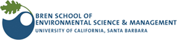
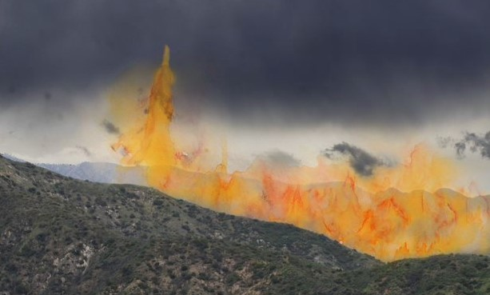
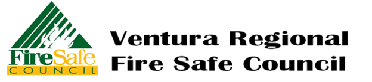

```{r setup, include=FALSE}
knitr::opts_chunk$set(echo = FALSE)

# Learn more about creating websites with Distill at:
# https://rstudio.github.io/distill/website.html

```



Kindling Equity is a team of Master's students from the Bren School of Environmental Science and Management at the UC Santa Barbara that is interested in bringing equity to the wildfire planning and mitigation process.



We are partnered with the Ventura Regional Fire Safe Council (VRFSC) to help facilitate the inclusion of communities most at risk of wildfire in the upcoming revision of the Ventura County Community Wildfire Protection Plan (CWPP).



