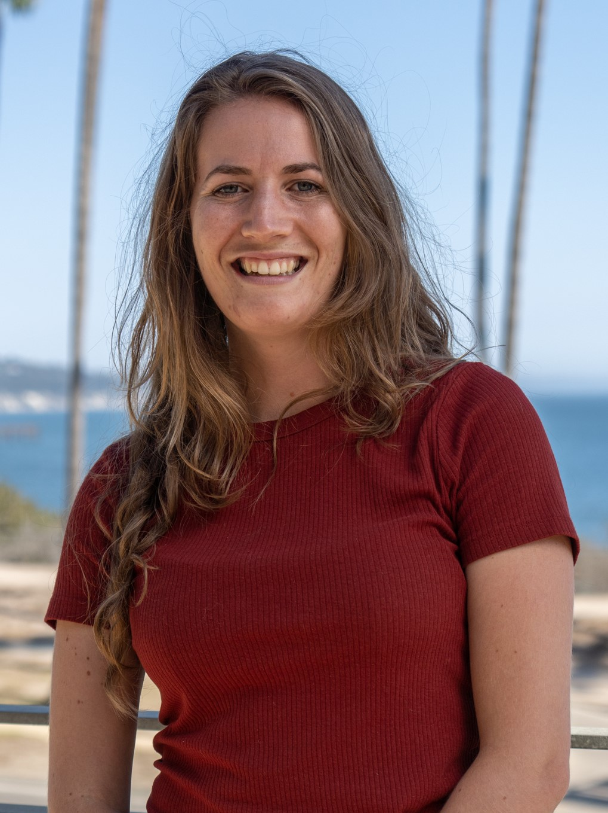
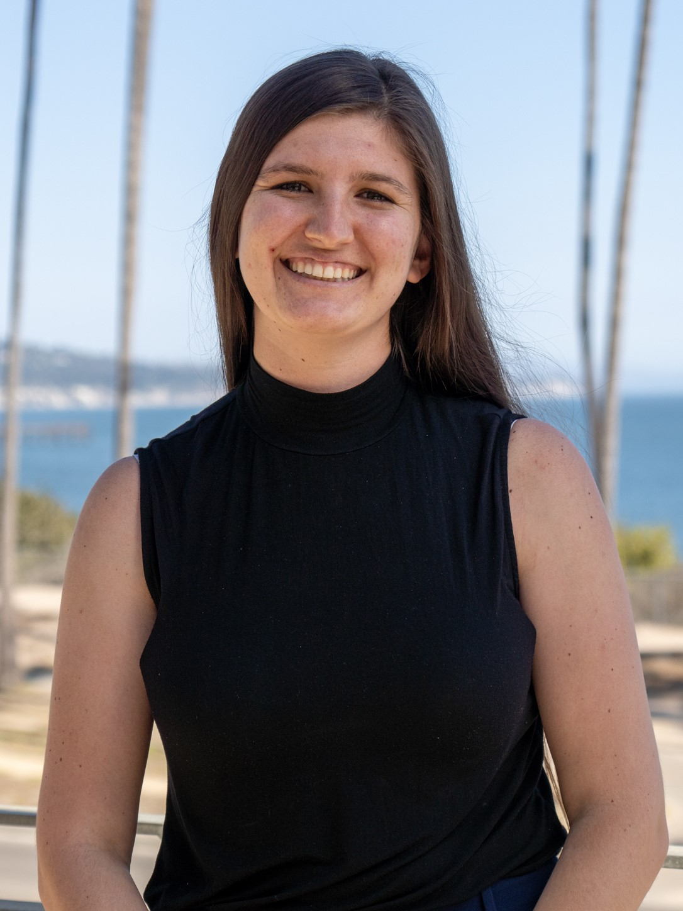

The Kindling Equity student team are graduates of the Masters of Environmental Science & Management (MESM) students at the Bren School of Environmental Science & Management at the University of California, Santa Barbara.

## Bri Baker

{width=50%}

A Ventura County local, Bri worked seasonally in California wildfire management and fire ecology while in grad school. She is passionate about making fire ecology and wildfire hazard more approachable and better understood by the public and is excited to serve her community by helping to elevate its marginalized voices.

 | [Linkedin](https://www.linkedin.com/in/brirosebaker/) |

## Yvonne Dinh

{width=50%}

Originally from the East Coast, Yvonne had little experience with fire hazard before the project but was excited to learn how it plays a role in the daily lives of vulnerable communities. She was especially interested in exploring how spatial science and community learning can be used supplementary in natural hazard decision making. 

 | [Linkedin](https://www.linkedin.com/in/yvonne-dinh-140bb7123/) |

## Iris Foxfoot

{width=50%}

Originally from the foothills of the Sierra Nevada Mountains, Iris spent the three years prior to grad school investigating how wildfire, drought, and climate change impact forest biodiversity in the Sierras. She was thrilled to join this project and to amplify local voices in the wildfire planning process.

 | [Linkedin](https://www.linkedin.com/in/iris-foxfoot-61958b202/) |

## Elena Ortiz

{width=50%}

As a recent transplant to the Central Coast, Elena was excited to be working on a project that allowed her to deeply engage with and get to know the community. She is passionate about making the environmental decision-making and planning process more equitable, and believes this project can have that kind of lasting impact in Ventura County. 

 | [Linkedin](https://www.linkedin.com/in/emortiz/) |

## Alison Sells

{width=50%}

Born and raised in Southern California, Alison grew up in close proximity to fires and was excited to learn more about the specific needs of vulnerable populations in Ventura County. She interned directly with VRFSC and helped connect with key organizations that support and represent these communities to ensure that all voices are heard in environmental decision making. 

 | [Linkedin](https://www.linkedin.com/in/alisonsells/) |

## Advisory Board

Our internal advisory team included Dr. Sarah Anderson and PhD. student Louis Graup.

Our external advisors were Kate Furlong and Elaine Himmelfarb (Ventura Regional Fire Safe Council), Dr. Max Moritz (UCSB affiliate), Celine Moomey (Ventura County Fire Department).
